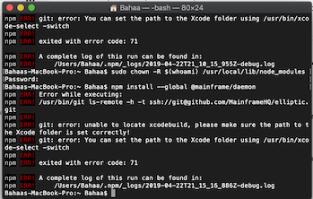

>Note: we are currently in the process of refactoring some of the Mainframe OS
architecture so this process can be simplified (essentially eliminating the need for step 1 below).
In the mean time here are some things to try if you're having trouble getting Mainframe OS setup and running.


**Background:** The Mainframe OS installer includes 2 necessary steps.

##### Step 1: Run the environment setup script (`Setup.command`)
The whole purpose of this step is to ultimately run the command:

`npm install --global @mainframe/daemon`

This installs the required daemon package so it can be launched and leveraged when running Mainframe OS.

For users who already have `npm` installed, this is a very straightforward command.
However not all users do, in fact most non-developers do not, which means first we have to
install `npm` which requires `node` and `brew` and `python` and XCode tools and and lots of other goodies be
installed and verified and configured correctly.


##### Step 2: Drag the Mainframe OS App Icon to the Applications folder

This installs the Mainframe OS binaries in the Applications folder. When the icon is clicked, the daemon
(installed above in step 1) is started, new environment set up (for first time run), and the Mainframe OS
application launches.

## Troubleshooting installation issues

### Javascript error when starting Mainframe OS


This error means the daemon was not correctly installed during Step 1 of the installation process.

Check the following:

- Run the setup script from Step 1 above (just in case somehow you missed Step #1 completely)
- If the setup script failed, but you know you already have `npm` installed, go ahead and just install the daemon manually (see below).
- Otherwise, see output from setup script for clues on which aspect failed and follow issues below for next steps.

### Try to install Mainframe daemon manually
You can skip the Setup.command script completely if you already have node and npm installed. You'll just need to install the Mainframe daemon manually.
Open the terminal application (launch from Applications/Utilities, or command-space to open Spotlight Search and find "terminal.app")
and run the following command:

`npm install --global @mainframe/daemon`

### Setup.command script asking for password

Certain steps in the environment setup script may require you to enter your macOS user password. You'll see a message and prompt
in the terminal window and it will pause waiting for your input. You'll need to click on the terminal window to put it in focus
then start typing. You won't see anything on the screen while you are typing your password so it may appear as though nothing is happening.
Hit `enter` after typing your password and the script should continue.


### Permissions error when installing Daemon

```
npm install --global @mainframe/daemon
npm WARN checkPermissions Missing write access to /usr/local/lib/node_modules
npm ERR! path /usr/local/lib/node_modules
npm ERR! code EACCES
npm ERR! errno -13
npm ERR! syscall access
npm ERR! Error: EACCES: permission denied, access '/usr/local/lib/node_modules'
npm ERR! { [Error: EACCES: permission denied, access '/usr/local/lib/node_modules']
npm ERR! stack:
npm ERR! 'Error: EACCES: permission denied, access \'/usr/local/lib/node_modules\'',
npm ERR! errno: -13,
npm ERR! code: 'EACCES',
npm ERR! syscall: 'access',
npm ERR! path: '/usr/local/lib/node_modules' }
npm ERR!
npm ERR! The operation was rejected by your operating system.
npm ERR! It is likely you do not have the permissions to access this file as the current user
npm ERR!
npm ERR! If you believe this might be a permissions issue, please double-check the
npm ERR! permissions of the file and its containing directories, or try running
npm ERR! the command again as root/Administrator (though this is not recommended)
```


If you run into this permissions problem either in the setup script or when trying to install the daemon manually, try the following two commands:

`sudo chown -R $(whoami) /usr/local/lib/node_modules`

`npm install --global @mainframe/daemon`

### Error in Setup.command script installing Node causing infinite loop, and other node-related installation issues

```
Warning: node@10 10.15.2 is already installed and up-to-date
To reinstall 10.15.2, run brew reinstall node@10
Checking system dependencies...
No local Node.js installations were found.
Checking system dependencies...
Installing Node.js...
Warning: node@10 10.15.2 is already installed and up-to-date
```

Run the following to assess your configuration:

##### Homebrew

`which brew`

should have ouput similar to this:
```
 Doug-Mainframe-MacBook-Pro:Downloads doug$ which brew
/usr/local/bin/brew
```

If you don't have brew installed, or want to try reinstalling, go to https://brew.sh for install/uninstall instructions


##### Node & NPM

**Node Version**

`node -v`

should have output similar to this:

```
Doug-Mainframe-MacBook-Pro:Downloads doug$ node -v
v11.14.0
```

Other versions of Node greater than 10 are also acceptable.

**NPM installed**

`echo $(npm config get prefix)`

should have output similar to this:

```
/Users/sarahwiley/.npm-global
```

If you don't have Node or NPM, then you can try to get it from nodejs.org, or homebrew, or nvm.

**Make sure Node/NPM is in your path**

`echo $PATH`

##### Python

`python --version`

should have output similar to this:

```
Doug-Mainframe-MacBook-Pro:Downloads doug$ python --version
Python 2.7.10
```

*Note: Mainframe OS installation does not work with Python version 3+. It must be version 2.x

### Xcode error when installing daemon



Install the latest version of MacOS Command Line tools.

https://developer.apple.com/download/more/
